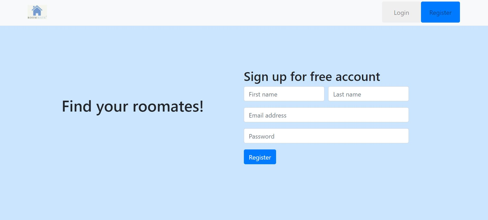
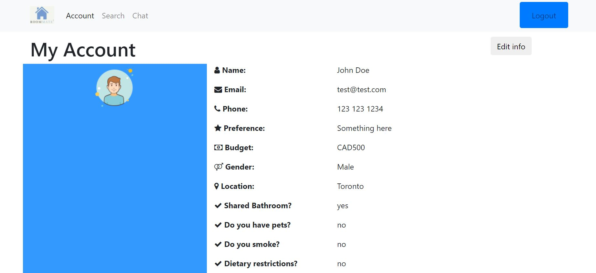
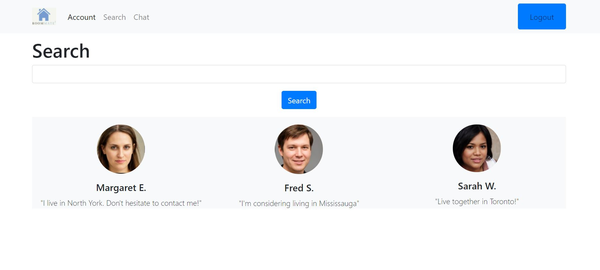
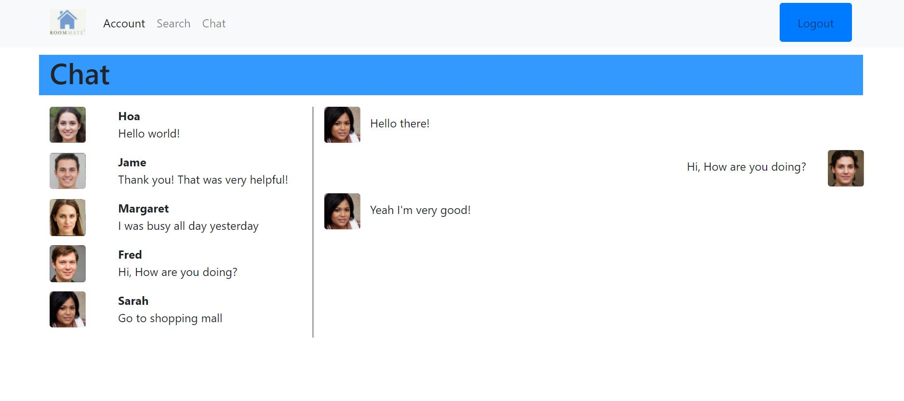

# Roommate Squared!
Your roommate mate! Roommate squared is your answer to finding the perfect people to live with! It connects strangers and helps make them family.

---
## App URL
https://find-roommates.herokuapp.com/

## Inspiration
One of the hardest parts about student housing is finding the best roommates for you. However that poses a challenge, because you're friends aren't always the best choice and its difficult to find people elsewhere. Social media and websites like Kijiji have become popular but have security and privacy risks when interacting with strangers. Our website aims to combat that by providing a safe option to finding roommates!

## What it does
Roommate squared is a website that connects you with other people looking for roommates. It's an alternative to using social media or websites like kijiji that may pose security or privacy risks.

## Images
#### Landing Page

#### Account Page

#### Search Page

#### Chat Page

## Built With
- Figma
- Bootstrap
- Node.js
- Express.js
- Heroku
- MongoDB

## Try it out
- [Overview](https://devpost.com/software/roommate-h75xoj)
- [YouTube](https://www.youtube.com/watch?v=PFgpb5PuoRE)
- [Figma](https://www.figma.com/proto/TT5gzaduqRwYoZ1ZOSzO12/TOHACKS-RoommatesSquared?node-id=1%3A2&scaling=scale-down&page-id=0%3A1)

## Author
Sanindie Silva - Prototype  
Hoa Nguyen - Front End  
Vinaya Sharma - Database, Design  
Takuto Okamoto - Back End  
(Team in the TOHacks 2021)
https://www.tohacks.ca/

## License
[MIT](https://choosealicense.com/licenses/mit/)
